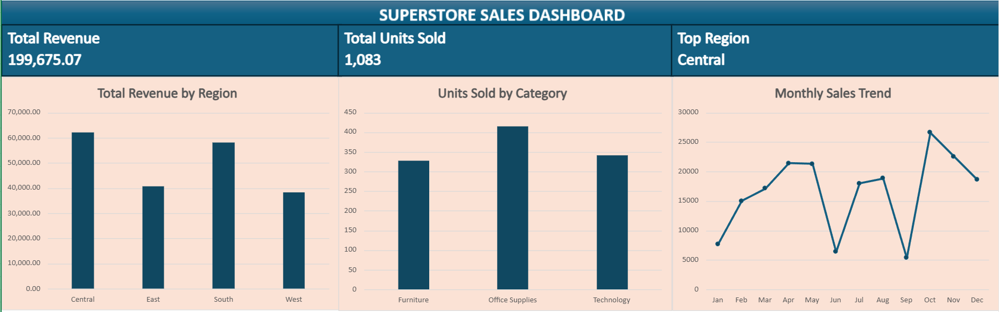

# Superstore Sales Dashboard

## Overview
This project presents an interactive Superstore Sales Dashboard created in Microsoft Excel to analyze sales performance.

## Dashboard Features
- Total Revenue: 199,675.07
- Total Units Sold: 1,083
- Top Region: Central
- Revenue Analysis by Region
- Units Sold by Category
- Monthly Sales Trend

## Tools & Skills Used
- Microsoft Excel
- Data Cleaning
- PivotTables
- PivotCharts
- KPI Cards
- Data Visualization
- Dashboard Design

## Dashboard
The dashboard provides a clear overview of regional revenue, product category performance, and monthly sales trends.
## Dashboard Preview

